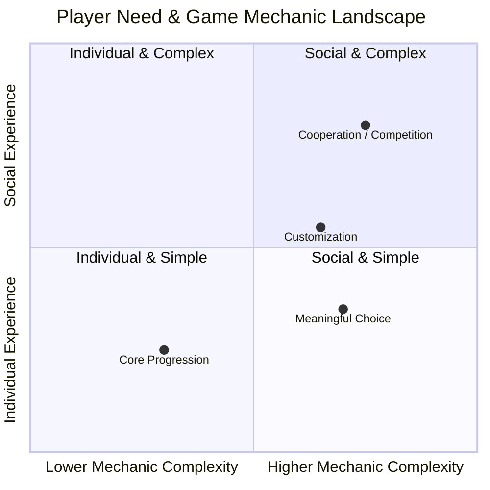
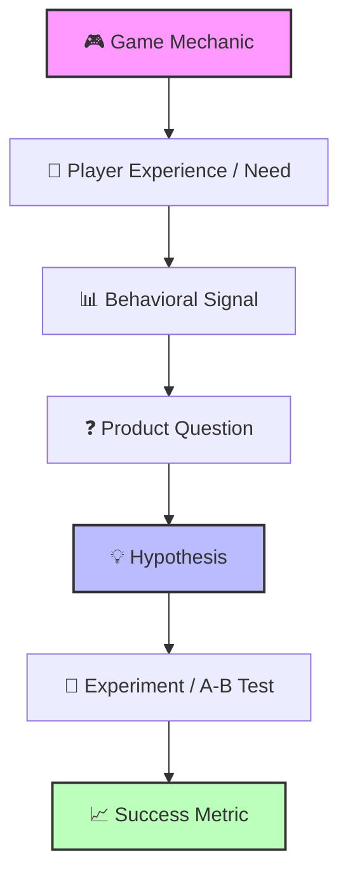

# 🎮 Game Product Strategy: Player Experience, Behavioral Mechanics & Design Patterns

An exploratory Product Management case study examining player motivation, game mechanics, friction, progression, and choice-driven experiences across mobile game genres.

---

📌 Strategic Overview

This case study explores how player experience and game design mechanics can be translated into product questions and testable hypotheses.

Rather than assuming that a specific mechanic directly causes retention, engagement, or monetization, the framework uses behavioral and psychological concepts as lenses for generating product hypotheses.

The goal is to connect:

Player Motivation → Game Mechanics → Behavioral Signals → Product Questions → Experiments

---

🧭 Core Product Frameworks

### 01. Choice, Agency & Player Experience

> **Product Perspective:** How might meaningful choices influence a player's sense of control, investment, and engagement?

Player agency is not simply about presenting multiple options. It concerns whether players perceive their decisions as meaningful and whether those decisions can influence their experience.

#### Choice vs. Agency
* **Superficial Choice:** Multiple options are presented, but the outcome remains essentially unchanged.
* **Meaningful Choice:** Player decisions influence progression, strategy, narrative, or the experience itself.
* **Player Agency:** The player perceives that their decisions meaningfully shape what happens next.

#### Product Questions
* When does a choice become meaningful from the player's perspective?
* Does giving players control over progression or playstyle change how they engage with a game?
* How might meaningful choices affect emotional or strategic investment?
* Which player behaviors could indicate that a choice mechanic is actually valuable?

#### Example Hypothesis
> **Hypothesis:** Meaningful choices may increase player investment when players can clearly perceive the consequences of their decisions.

This hypothesis could be explored through:

Choice → Perceived Control → Investment → Engagement / Return Behavior

The relationship should be validated through player research or controlled experimentation rather than assumed as causal.

---

### 02. Progression, Difficulty & Player Friction

> **Product Perspective:** How might progression and difficulty shape the player experience throughout the game journey?

Progression gives players a sense of movement and achievement, while difficulty introduces challenge and friction. From a product perspective, the important question is not simply whether a game becomes harder, but whether the difficulty curve remains aligned with the player's developing skills and expectations.

#### Progression vs. Friction
* **Progression:** New levels, abilities, challenges, rewards, or content that create a sense of advancement.
* **Difficulty:** The increasing challenge players need to overcome as they progress.
* **Friction:** Moments where the effort required to continue may exceed the player's perceived value or motivation.

#### Product Questions
* Where might difficulty begin to feel frustrating rather than challenging?
* Does progression provide a clear sense of achievement?
* How might sudden increases in difficulty affect player behavior?
* Could players have different responses to the same level of difficulty depending on their previous experience?
* Which behavioral signals could indicate a progression or difficulty problem?

#### Example Hypothesis
> **Hypothesis:** A sudden increase in difficulty may lead to higher drop-off when players do not perceive sufficient progress or reward for the effort required.

Difficulty Increase → Friction → Progression Perception → Continued Play / Drop-off

The relationship should be validated through behavioral data, player research, or controlled experimentation.

---

### 03. Engagement & Behavioral Loops

> **Product Perspective:** What gives players a reason to return, and does the engagement create lasting product value?

Games use systems such as daily challenges, streaks, rewards, unlocks, and progression loops to encourage continued interaction. Their impact should be evaluated through player behavior rather than assumed.

#### Product Questions
* What gives a player a meaningful reason to return?
* Which mechanics create sustained engagement rather than short-term activity?
* Could a reward increase activity without improving the overall experience?
* Which behaviors indicate that a feature is providing value?

#### Example Hypothesis
> **Hypothesis:** A recurring feature may encourage return behavior when it provides a meaningful reason to continue progression rather than functioning only as an external reward.

Feature Exposure → Feature Usage → Continued Engagement → Return Behavior

Possible signals include feature adoption, usage frequency, session frequency, and return behavior.

---

### 04. Player Motivation

> **Product Perspective:** What underlying player needs might a game experience serve?

Players can engage with games for different reasons, including mastery, achievement, immersion, discovery, social connection, competition, and creativity. These motivations should be treated as potential lenses rather than universal player profiles.

#### Motivation vs. Product Experience

| Player Motivation | Possible Game Mechanics |
| :--- | :--- |
| **Mastery** | Increasing challenge, strategy, skill progression |
| **Achievement** | Levels, rewards, collectibles |
| **Discovery** | Exploration, unlockable content |
| **Agency** | Meaningful choices and consequences |
| **Social** | Cooperation, competition, shared goals |
| **Creativity** | Customization, building, self-expression |

#### Product Questions
* Which player need is the product experience trying to serve?
* Do the game's mechanics reinforce that experience?
* Could different player motivations lead to different engagement patterns?

---
### 05. Monetization & Player Value

> *Product Perspective:* How can monetization create value without weakening the player experience?

Monetization is not only a revenue mechanism. From a product perspective, it should also be considered in relation to progression, player value, friction, and long-term engagement.

#### Product Questions
* What value is the player receiving in exchange for a purchase?
* Where does monetization appear within the player journey?
* Could a monetization mechanic introduce unnecessary friction?
* Is monetization occurring alongside sustained engagement or independently of it?

#### Example Hypothesis
> *Hypothesis:* Monetization opportunities may perform differently depending on when they appear in the player journey and the value they provide at that moment.

Player Need → Product Value → Monetization Opportunity → Player Response

The relationship should be evaluated using behavioral data and controlled experiments rather than assumed.

---

### 06. From Game Mechanic to Product Hypothesis

The previous sections provide lenses for thinking about game mechanics. This framework turns those observations into testable product questions.

#### Product Thinking Framework
#### Product Thinking Framework

---

📚 Research Sources

Player Motivation

- "Quantic Foundry — Gamer Motivation Model" (https://quanticfoundry.com/gamer-motivation-model/)
  Reference for player motivation dimensions including Mastery, Achievement, Immersion, Social, Action, and Creativity. The model was developed using factor analysis of gamer data.

- "Cheah, Shimul & Phau — Motivations of Playing Digital Games" (https://doi.org/10.1002/mar.21631)
  A systematic review of 91 peer-reviewed studies examining recurring themes in digital gaming motivation, including immersion/flow, social interaction, identification, and goal orientation.

Choice & Player Agency

- "Cardona-Rivera et al. — Foreseeing Meaningful Choices" (https://scholars.uky.edu/en/publications/foreseeing-meaningful-choices/)
  Used as a reference for the relationship between meaningful differences in choice outcomes and perceived player agency.

Challenge, Difficulty & Engagement

- "Hamari et al. — Challenging Games, Engagement, Flow & Immersion" (https://doi.org/10.1016/j.chb.2015.07.045)
  Used as a conceptual reference for the relationship between perceived challenge, skill, engagement, and flow.

«Research Note:
Research findings and psychological concepts in this case study are used as analytical lenses for generating product questions and hypotheses. They are not treated as universal rules or direct evidence of causality. Product hypotheses should be validated through player research, behavioral data, or controlled experimentation.»
